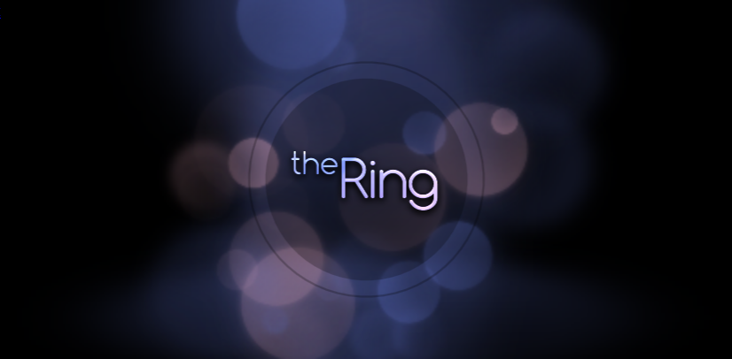

# The Ring

Minimalist meditative arcade puzzle game.

[](https://rpekarsky.github.io/the-ring/)

▶ **[Play in browser](https://rpekarsky.github.io/the-ring/)**

---

## History

Originally built in **2014** as an entry for theRussian Tizen App Challenge

The codebase then sat ina Dropbox backup for ~12 years. In **2026** it was archaeologically recovered, with the Tizen-specific scaffolding (widget manifest, hardware-key handlers, build deltas, Mercurial vestiges) stripped out, and the project reshaped into a plain web app deployable as static GitHub Pages.

The original gameplay code is intact — no rewrites, no logic changes. Only the surrounding plumbing was modernized.

The revival pass was driven with [Claude Code](https://www.claude.com/product/claude-code) as a collaborator: it audited the legacy codebase, identified the Tizen-coupled pieces, planned the cleanup, applied the changes, and helped patch the autoplay-policy issue that modern browsers introduced after 2017. The original game code from 2014 was written by hand without AI assistance.

## Tech stack

Aggressively 2014:

- **[Pixi.js v1.6.0](https://github.com/pixijs/pixijs)** — WebGL/Canvas2D renderer (ancient API, predates Pixi 2.x)
- **[buzz.js](https://github.com/jaysalvat/buzz)** — HTML5 audio wrapper
- **[GreenSock TweenLite + EasePack](https://greensock.com/)** — tweening
- **[JS-Signals](https://millermedeiros.github.io/js-signals/)** — event dispatch
- **[Victor.js](http://victorjs.org/)** — 2D vector math
- **[Mousetrap](https://craig.is/killing/mice)** — keyboard shortcuts
- **[Grunt](https://gruntjs.com/)** — concat + uglify build

No modules, no transpilation, no framework. 38 JS files concatenated in script-tag order into a single `out/out.js` bundle. Uglify-mangling toplevel globals broke Pixi 1.6's dispatch chain, so production ships unminified.

## Run locally

```bash
npm install
npm run build         # build out/out.min.js
npm start             # static server on :8765
# open http://localhost:8765/index.html   (dev — unbundled scripts)
# open http://localhost:8765/min.html     (prod — bundled out.min.js)
```


## Build

```bash
npm run build   # concat → out/out.js
```

## Controls

**Touch / Mouse:**

- Drag in a circle around the center — rotate the ring
- Tap anywhere — interact (select menu item / lock current block)
- Tap-and-hold then release outside the play area — back

**Keyboard:**

| Key | Action |
|-----|--------|
| ← / A | Rotate counter-clockwise |
| → / D | Rotate clockwise |
| ↑ / W / Space / Enter | Tap / select / interact |
| ↓ / S | Back |
| Esc / Backspace | Back |

Highscores per mode are stored in `localStorage`.

## Credits

- **Code & design**: Roman Pekarsky

- **2026 revival**: with [Claude Code](https://www.claude.com/product/claude-code)

- **Sound effects**: mechanical keyboard click recordings ("Akko Lavenders" pack) by [@mshareef-git](https://github.com/mshareef-git), originally contributed to [monkeytypegame/monkeytype](https://github.com/monkeytypegame/monkeytype/pull/7764) under GPL-3.0

## License

Code: **[GNU AGPL-3.0](https://www.gnu.org/licenses/agpl-3.0.html)** (see [`LICENSE`](./LICENSE)). Self-hosting, forking, and modification are welcome — but any modified version distributed or run as a network service must release its source under the same license. Bundled third-party libraries remain under their original licenses (MIT / Apache-2.0 / SIL OFL / GreenSock) and are listed in the same file.

---

## Status

🏛️ **Archive / playable demo.** Not actively maintained.